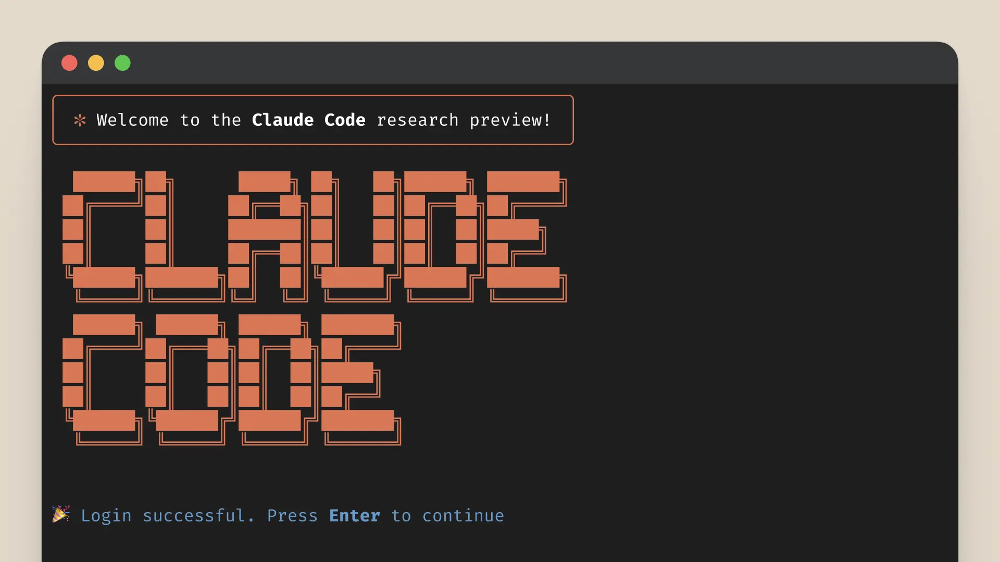

# Claude Code (CC)

<!-- 

 -->

[Claude Code](https://www.anthropic.com/claude-code) 是由 Anthropic 在 2024 年 12 月發布的一款 AI Coding Agent 工具 ，目的幫助開發者在終端機中將想法更快地轉化為程式碼，可以搜尋和讀取程式碼、編輯檔案、編寫和執行測試、提交並推送程式碼到 GitHub，以及使用命令列工具等操作。


## 如何使用


src: https://x.com/sidbidasaria

### 初次安裝

初次使用前需要先安裝 Claude Code

```bash
npm install -g @anthropic-ai/claude-code
claude --version
```


更多相關安裝方法，請參考：[Anthropic Quickstart - Anthropic](https://docs.anthropic.com/en/docs/claude-code/quickstart)

### 基礎指令

使用 Claude Code，最基礎有兩種方式，一種是互動模式也就是多輪對話的互動介面；另一個則是一次性詢問的方式，只執行一次互動操作。還有其他像是 pipeline 等方式也可以與 Claude Code 互動。

1. **啟動互動模式**

   於終端機輸入 `claude`，按下 Enter 即可進入對話模式。輸入 `/exit` 或 `/quit` 可退出互動模式。

   ```powershell
   claude
   ```

   

2. **一次性詢問**

   不想進入互動模式？直接在命令列輸入 `claude "你的問題"`，即可取得即時回答，例如 `"這段代碼有什麼問題？"` 或 `"幫我寫個快速排序"`。

   ```powershell
   claude "tell me what this project is doing"
   ```

   互動完成後會停留在互動模式，可以繼續使用 Claude Code。

3. **管道處理（Pipe）**

   可以把文件或輸出的結果透過管道傳入 `claude`，比如：

   ```bash
   cat main.py | claude "optimize this code"
   cat README.md | claude "translate into chinese"
   git diff | claude "explain this change"
   ```

   可以直接分析內容、優化或翻譯，省時省力。

4. **純文字輸出**

   預設輸出為 Markdown 格式，加上 `-p` 後就會輸出純文字並直接退出，例如：

   ```bash
   claude -p "generate mysql json statement example" > query.sql
   ```

   非互動、純結果導出。

5. **查看幫助**

   忘記指令？輸入 `claude --help`，即可查看全部命令說明。

   

若想要退出 直接使用 `/exit`, `/quit` 就可以了。

### 配置管理

若希望更客製化的配置資訊， Claude Code 提供大量的方法可以根據個人要求進行相應配置。

- **查看目前配置**

  可查看當前使用的模型、API 金鑰等資訊。

  ```bash
  claude config list
  ```

- **查看特定設定值**

  ```bash
  claude config get <key>
  ```

  查詢某一個設定的當前值。

- **修改設定值**

  ```bash
  claude config set <key> <value>
  ```

  將某一個設定更新為新值。

- **對「列表型設定」新增項目**

  ```bash
  claude config add <key> <value>
  ```

  在清單型設定中加入一個新項。

- **對「列表型設定」移除項目**

  ```bash
  claude config remove <key> <value>
  ```

  從清單型設定中刪除指定項目。

更多配置管理可以參考：[Anthropic Claude Code settings - Anthropic](https://docs.anthropic.com/en/docs/claude-code/settings)

### 工具管理（MCP）

Claude Code 本身也完全支援 MCP 來連結外部工具，擴展自身能力：


_src: https://norahsakal.com/blog/mcp-vs-api-model-context-protocol-explained/_

1. **列出所有已安裝的 MCP**

```bash
claude mcp list
```


2. **查看某個 MCP 的詳細設定**

```bash
claude mcp get playwright
```


3. **安裝常用 MCP**，如下所示：

- 安裝 Playwright：

```bash
claude mcp add playwright -s user -- npx @playwright/mcp@latest
```

- 安裝 Sequential Thinking：

```bash
claude mcp add sequential-thinking -s user -- npx -y @modelcontextprotocol/server-sequential-thinking
```

- 安裝 Puppeteer：

```bash
claude mcp add puppeteer -s user -- npx -y @modelcontextprotocol/server-puppeteer
```

- 安裝 Context7：

```bash
claude mcp add context7 -- npx @upstash/context7-mcp
```

4. **移除 MCP**

```bash
claude mcp remove "playwright" -s user
```

5. **檢視 MCP 狀態（互動模式下）**

進入 `claude` 後使用，即可查看目前所有 MCP 狀態：

```bash
/mcp
```


除此之外還可以使用 .mcp.json 設定

```json
{
  "mcpServers": {
    "playwright": {
      "args": ["@playwright/mcp@latest", "--headless"],
      "command": "npx"
    },
    "context7": {
      "args": ["-y", "@upstash/context7-mcp@latest"],
      "command": "npx"
    }
  }
}
```

更多可以參考：[Anthropic Connect Claude Code to tools via MCP - Anthropic](https://docs.anthropic.com/en/docs/claude-code/mcp)

### 進階操作

在 `claude` 的互動模式中，除了輸入問題，也能使用以下命令加速流程：

**壓縮對話上下文**

有時因為使用的狀況會導致上下文過長，此時可以選擇清除多餘歷史，只保留摘要在上下文中。

```bash
/compact  <optional custom summarization instructions>    # Clear conversation history but keep a summary in context. Optional: /compact [instructions for summarization]
```


**清除會話歷史**

又或是可以完全重置會話，釋放上下文空間。

```bash
/clear (reset) # Clear conversation history and free up context
```


**接續上次的對話**

還可恢復之前的對話狀態繼續使用。

```bash
/resume      # Resume a conversation
```


**記憶模式 (項目級別/全域級別)**

輸入 `#` 可進入 **記憶編輯模式**，用來修改 `CLAUDE.md`：

- 專案級：`./CLAUDE.md`
- 全域級：`~/.claude/CLAUDE.md`

```bash
#
```


**讀圖片**

1. **拖曳圖片到終端**：可以直接將圖片檔案拖拽到正在執行 Claude Code 的終端視窗中。Claude 將能夠「看到」並分析這個圖片。

   

2. **複製貼上圖片（macOS）**：在 macOS 上，可以使用 `Control` + `V`（不是 `Command` + `V`）將其貼上到 Claude Code 中。

**回撤操作**

有時會希望 Claude Code 回撤此前的操作，除了可以使用 `esc` 或是直接告訴 Claude Code 以外，還可以參考下面 ccundo 來進行回撤。

- https://github.com/RonitSachdev/ccundo

實際上 Claude Code 會把相關歷史紀錄都儲存在 `C:\Users\USER\.claude\projects\` （Windows）下的相關專案紀錄中。

**IDE 整合**

若想整合其他 IDE，則可以使用 /ide 這樣一來就可以與其整合。


像是若與 VSCode 整合，假設選取一段程式碼，Claude Code 是可以知道你所選取的程式碼區段內容。


**hook**

Claude Code hooks 是使用者定義的 shell 命令，在 Claude Code 生命週期的各個時點執行。Hooks 提供對 Claude Code 行為的確定性控制，確保某些動作的觸發，而不是依賴 LLM 選擇執行。

舉例以下幾個場景：

- 通知：自訂當 Claude Code 等待您的輸入或執行權限時如何通知您。
- 自動格式化：在每次檔案編輯後對 .ts 檔案執行 prettier，對 .go 檔案執行 gofmt 等。
- 記錄：追蹤和計算所有執行的命令以符合合規性或除錯需求。
- 回饋：當 Claude Code 產生不符合您程式碼庫慣例的程式碼時提供自動回饋。
- 自訂權限：阻止對生產檔案或敏感目錄的修改。

更多可以參考：[Anthropic Hooks reference - Anthropic](https://docs.anthropic.com/en/docs/claude-code/hooks)

**子代理（Subagent）**

Claude Code 中的自定義子代理是專門的 AI 助手，可以被調用來處理特定類型的任務。

- 具有自定義系統提示（system prompt）
- 工具和獨立上下文窗口（context windows）的特定任務配置
- 可重用性
- 彈性的權限管理

更多可以參考：[Anthropic Subagents - Anthropic](https://docs.anthropic.com/en/docs/claude-code/sub-agents)

### 常見問題

**連接問題**

```powershell
# test api/network connection
claude "test connection"

# check config
claude config get api-key
claude config get model
```

**性能優化**

```powershell
# enable cache
claude config set cache-enabled true

# set max-concurrent
claude config set max-concurrent 3

# adujst timeout
claude config set timeout 30
```

**調試模式**

```powershell
# enable verbose mode
claude --verbose "question"

# debug
claude --debug "debug command"
```

## 最佳實踐

### 初始化配置

**創建 CLAUDE.md**

`CLAUDE.md` 是 Claude Code 中的重要配置文件，用來定義 Claude Code 的行為與上下文資訊，會被自動讀取到上下文中。

通常包含以下資訊：

- **項目概述**
- **開發環境設置**
- **代碼庫結構**
- **使用指南**
- **開發工作流程**
- **限制和注意事項**

創建的方式可以使用 `/init` 命令，或是手動建立：

```bash
/init
```


Claude Code 讀取 `CLAUDE.md` 設定檔的優先順序和搜尋路徑：

1. 專案根目錄：`./CLAUDE.md`（推薦使用，可提交至 git，團隊成員共享相同的配置）
2. 專案本地：`./CLAUDE.local.md`（不須提交到 git，通常添加到 .gitignore，用於個人開發環境的特殊設置）
3. 全域設定：`~/.claude/CLAUDE.md`（適用於所有沒有專案特定配置的情況）

父目錄和子目錄中也會被自動讀取。

**配置工具權限**

Claude Code 中也需要進行權限的控管，避免非預期行為的發生。透過以下方式進行權限設定：

- 使用 `/permissions` 命令
- 手動編輯 `.claude/settings.json`
- 啟用 `--allowedTools` 參數
- 使用 `--dangerously-skip-permissions`

**MCP 工具**

Claude Code 可透過三種方式連接任意數量的 MCP 伺服器：

- 專案配置中（在該目錄執行 Claude Code 時可用）
- 全域設定中（所有項目可用）
- 提交到 .mcp.json⁠ 檔案（任何在你程式碼庫工作的成員都可用）。例如，你可以在 .mcp.json⁠ 新增 Puppeteer 和 Sentry 伺服器，方便每位工程師開箱即用。
- 用 MCP 時，建議用 --mcp-debug⁠ 標誌來幫助排查設定問題。

**自定義命令**

對於重複性高的工作流（例如：日誌分析），可以在 `.claude/commands` 目錄下創建自定義的命令，是 Claude Code 支援的 **專案級自定義 Slash Commands** 儲存位置。你可以透過 Markdown 檔案定義常用 prompt 指令，可以用於 Claude Code 中。

```markdown
---
allowed-tools: Bash(git add:*), Bash(git status:*), Bash(git commit:*)
description: Create a git commit
---

## Context

- Current git status: !`git status`
- Current git diff (staged and unstaged changes): !`git diff HEAD`
- Current branch: !`git branch --show-current`
- Recent commits: !`git log --oneline -10`

## Your task

Based on the above changes, create a single git commit.
```

更多參考：[Anthropic Slash commands - Anthropic](https://docs.anthropic.com/en/docs/claude-code/slash-commands)

**上下文管理**

若希望更好的使用上下文，可以參考以下用法：

- 使用 `@` 引用文件
- 任務切換時使用 `/clear` 清空上次任務訊息
- 長時間會話使用 `/compact` 定期壓縮上下文
- 將重要資訊透過 `#`（memory 功能） 記錄到 `CLAUDE.md` 中
- 使用 `/resume` 恢復歷史會話；也可以啟動時恢復，指令為 `claude --continue`。

### 小技巧

**更換 LLM Provider**

有時你可能想要切換 Claude Code 預設的 API Provider（例如切換到自建 Proxy 服務）。這可以透過環境變數完成：

```powershell
ANTHROPIC_AUTH_TOKEN = "sk-..."
ANTHROPIC_BASE_URL = "..."
```

- [musistudio/claude-code-router](https://github.com/musistudio/claude-code-router)

**具體說明需求**

把需求說清楚、說具體，避免「修一下 bug」這種籠統指令；具體到模組/錯誤型態/期望行為，回應品質更高。

**把複雜的需求分步執行**

大任務拆小步：先接口、再驗證、再測試… 每一步完成就 review/測試，再進下一步，能避開上下文過長與輸出截斷。

**先理解專案程式碼再操作**

在動手改前，先讓 Claude 掃描與解讀系統設計、資料表、錯誤處理流等，再提出修改要求，成功率更高。

**多使用快捷鍵**

- `/` 檢視所有斜線命令
- ↑/↓ 瀏覽歷史、Tab 自動補全
- Option+Enter（macOS）換行、Ctrl+C 離開

  這些能大幅提速日常操作。

**使用免授權模式**

長流程常被「要求授權」打斷時，可用：

```markdown
claude --dangerously-skip-permissions
```

建議在離線容器中使用，降低風險。

**啟發思考模式**

若在對話中可以使用以下詞啟發 Claude Code 進行深度思考：

```powershell
think
think hard
think harder
ultrathink
```

**若發現錯誤，及時打斷**

若發現提示指令下錯，或是 Claude Code 執行過程不如預期，可以使用 `esc` 及時打斷，以免造成後續麻煩。

**發送圖片**

可貼圖片讓 Claude Code 讀圖說明錯誤/按設計稿還原 UI 等。

**恢復歷史對話**

- 非互動模式：

  ```bash
  claude --continue
  claude --resume
  ```

- 互動模式：
  - 輸入 `/resume` 從清單選擇會話繼續。

**記憶管理**

- 記憶檔位置與用途：
  - 專案共享：`./CLAUDE.md`（規範/工作流/風格等）
  - 使用者全域：`~/.claude/CLAUDE.md`（個人偏好）
  - 本地專案偏好：`./CLAUDE.local.md`
- 互動中用 `/memory` 打開並編輯記憶檔。

  啟動時會自動遞迴載入路徑上的 `CLAUDE.md`。

**編輯記憶檔案**

在 `/memory` 清單中選目標檔（如 `~/.claude/CLAUDE.md`），加入如「請用繁體中文回答」等個人規則，即可長期生效。

**Git 交互**

用自然語言驅動 Git：

- 「我修改了哪些文件」→ 顯示變更
- 「用合理描述性信息提交我的更改」→ 產生提交訊息並提交
- 「推送本分支到遠端 / 建立 feature 分支 / 顯示最近 3 次提交檔案」等皆可直說。

**Linux 交互**

互動模式或一次性 `-p` 皆可讓 Claude 生成並執行複雜 Shell 指令（如列出行數最多的前 3 個 .java 檔）。

**查看消耗狀況**

- `/cost` 檢視當前會話花費。
- [ryoppippi/ccusage](https://github.com/ryoppippi/ccusage)

**必要時上下文壓縮**

`/compact` 清除對話歷史但保留摘要，降低 token 與上下文長度；也可在 `/config` 控制自動壓縮（接近 95% 容量時會自動觸發）。

**自定義快捷指令**

- 位置：
  - User level：`~/.claude/commands/`（所有專案可用，前綴 `/user:`）
  - Project level：`./.claude/commands/`（僅當前專案，前綴 `/project:`）

**進入 Bash 模式**

在命令前加 `!`，即可進入 Bash 模式，由系統直接執行。

**自動接受編輯、使用計畫模式**

按下 `Shift + Tab` 切換「auto‑accept edits」模式。開啟後，Claude Code 會**自動創建及編輯檔案**，省去逐次確認。比 `--dangerously-skip-permissions` 更安全，作用範圍也僅限編輯操作。

同樣使用 `Shift + Tab` 切換「plan mode」。開啟後，Claude Code 會生成功能規劃，並詢問是否執行。如果選擇「Yes, and auto-accept edits」，它將自動切換到自動接受編輯模式，依計畫完成所有工作。

若遇到問題可以看看這個 Issues：[anthropics/claude-code/issues/3368](https://github.com/anthropics/claude-code/issues/3368)

**使用 MCP 提升效率**

Claude Code 支援 MCP 協議，可加入多種服務器工具（如 browser 自動化、最新文件查詢等）。

- 管理 MCP：

  ```bash
  claude mcp list
  claude mcp get <name>
  claude mcp remove <name>
  ```

- 使用 `/mcp` 指令查看相關資訊。

**快速跳轉前訊息**

連按兩次 `Esc` 可跳出訊息歷史視窗，選擇 msg 後可返回並重新編輯該 prompt。有效避免重打指令。

**還原程式碼版本**

輸入 `rollback` 即可回退到先前 checkpoint，若想取消回退，再輸入 `undo` 即可復原。類似 Cursor 的 checkpoint 功能，十分便利。但務必仍使用 Git 控制版本，保護資料。

- [RonitSachdev/ccundo](https://github.com/RonitSachdev/ccundo)

**更新版本保持最新功能**

使用以下命令升級 Claude Code：

```bash
npm install -g @anthropic-ai/claude-code
claude --version
```

Claude Code 的最大優勢在於其**靈活性**和**終端原生體驗，**不會綁定你到特定的 IDE，而是作為一個 CLI 工具，可以與任何現有的 IDE 配合使用。相比 Cursor、Windsurf 等 AI 編程工具需要完全切換到新的 IDE 環境或學習全新界面，Claude Code 讓開發者能保持原有的工作流程，同時在熟悉的終端環境中獲得 AI 協助。反映並體現了現代開發者對**效率與靈活性**的追求，就像我們習慣在手機上快速切換各種 app 來完成不同任務，Claude Code 讓開發者無需離開熟悉的終端環境，就能透過自然語言指令快速將想法轉化為程式碼，同時也反映了當代「工具應該適應人，而非人適應工具」的理念，讓 AI 助手融入開發者既有的工作流程中，而不是強迫改變習慣，這正是現代生活與 AI 協作所追求「無縫整合」體驗的最佳體現。

## 參考來源

- [Claude Code 官方網站](https://www.anthropic.com/claude-code)
- [Claude Code 官方文件](https://docs.anthropic.com/en/docs/claude-code/overview)
- [Anthropic 團隊如何使用 Claude Code](https://www.anthropic.com/news/how-anthropic-teams-use-claude-code)
- [Anthropic Learn](https://www.anthropic.com/learn)
- [Claude Code 官方教學影片](https://youtu.be/gv0WHhKelSE)
- [Claude Code 教學影片播放清單](https://youtube.com/playlist?list=PLf2m23nhTg1P5BsOHUOXyQz5RhfUSSVUi)
- [Claude Code 功能介紹影片](https://youtu.be/e5O8A5pcVgg)
- [用神器 Claude Code！打造贴身 AI 秘书团【小白教程】-哔哩哔哩](https://b23.tv/0muLyXg)
- [Claude Code 初识：已经在用 Cursor 的我，为何还要用 CC 🤔-哔哩哔哩](https://b23.tv/LSByZFH)
- [Claude Code 指令指南（ctok.ai）](https://docs.ctok.ai/claude-code-commands-guide.html)
- [Claude Code 中文文檔（deeptoai）](https://cc.deeptoai.com/docs)
